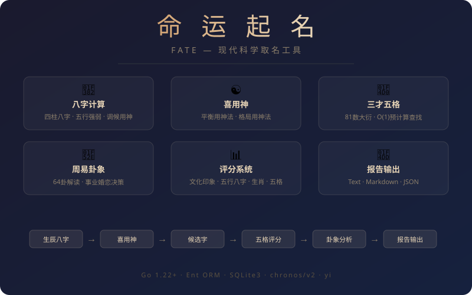
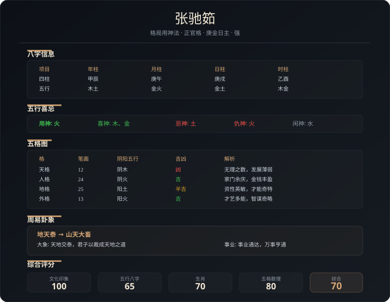

# 命运起名 Fate

<p align="center">
  <strong>现代科学取名工具 — 基于八字五行·三才五格·周易卦象的智能起名系统</strong>
</p>

<p align="center">
  
</p>

<p align="center">
  <a href="README_EN.md">English</a> | 中文
</p>

---

## ✨ 特性

- 🎂 **八字计算** — 四柱八字、五行强弱、调候用神
- ☯️ **双算法喜用神** — 平衡用神法 + 格局用神法（正官格/七杀格/食神格等10种格局）
- 📐 **三才五格** — 81数大衍、阴阳五行、预计算O(1)查找（3.89ns/op）
- 🔮 **周易卦象** — 64卦完整解读（大象/事业/经商/求名/婚恋/决策）
- 📊 **四维评分** — 文化印象 / 五行八字 / 生肖 / 五格数理
- 📝 **多格式输出** — Text / Markdown / JSON（美名腾风格）
- 🏛️ **简繁对照** — 400+常用汉字简繁体映射

## 📸 报告预览

<p align="center">
  
</p>

## 🚀 快速开始

### 环境要求

- Go 1.22+
- GCC（SQLite3 CGO 依赖）
- SQLite3

### 安装

```bash
git clone https://github.com/babyname/fate.git
cd fate
go mod download
```

### 生成姓名分析报告

```bash
# 使用内置工具生成示例报告
go run github.com/babyname/fate/cmd/gen_report

# 输出文件在 output/ 目录
ls output/
# 张_姓名分析报告_平衡用神法.txt
# 张_姓名分析报告_平衡用神法.md
# 张_姓名分析报告_平衡用神法.json
# 张_姓名分析报告_格局用神法.txt
# 张_姓名分析报告_格局用神法.md
# 张_姓名分析报告_格局用神法.json
```

### 代码中使用

```go
package main

import (
    "fmt"
    "time"

    "github.com/babyname/fate/internal/analysis"
    v2 "github.com/godcong/chronos/v2"
)

func main() {
    // 1. 计算八字和喜用神
    born, _ := time.Parse("2006/01/02 15:04", "2024/06/15 10:30")

    // 平衡用神法
    fateData, _ := v2.GetFateData(&v2.FateInput{
        BirthDate: born,
        Gender:    1,       // 1=男, 2=女
        Surname:   "张",
        Method:    v2.XiYongMethodBalance, // 平衡用神法
    })

    // 格局用神法
    fateData2, _ := v2.GetFateData(&v2.FateInput{
        BirthDate: born,
        Gender:    1,
        Surname:   "张",
        Method:    v2.XiYongMethodGeJu,   // 格局用神法
    })

    // 2. 构建名字分析结果
    c1 := &ent.Character{Char: "驰", WuXing: "火", ScienceStroke: 13, ...}
    c2 := &ent.Character{Char: "筎", WuXing: "木", ScienceStroke: 12, ...}
    result := analysis.BuildNameResult(1, "张", c1, c2, 11, 0, fateData)

    // 3. 生成报告
    report := analysis.NewReport("张", "2024年06月15日", "男", fateData, 1000)
    report.TopNames = append(report.TopNames, result)

    // 输出 Markdown
    f := &analysis.MarkdownFormatter{}
    f.Format(os.Stdout, report)
}
```

## 🏗️ 项目结构

```
fate/
├── cmd/
│   └── gen_report/          # 报告生成工具
├── ent/                     # Ent ORM 实体定义
│   └── character.go         # 字符实体（简/繁笔画、五行、偏旁等）
├── internal/
│   ├── analysis/            # 核心分析模块
│   │   ├── analysis.go      # 数据结构 + 格式化器
│   │   ├── sancai_data.go   # 三才/基础运/成功运/人际关系数据
│   │   ├── zhouyi.go        # 周易卦象计算
│   │   ├── zhouyi_data.go   # 64卦解读数据
│   │   └── simplified_traditional.go  # 简繁对照表
│   ├── wuge/                # 三才五格
│   │   ├── wuge.go          # 五格计算
│   │   ├── dayan.go         # 81数大衍
│   │   └── result.go        # O(1)预计算查找表
│   ├── wuxing/              # 五行分析
│   │   ├── san_cai.go       # 三才五行
│   │   └── wu_xing.go       # 125种三才组合吉凶
│   ├── rating/              # 评分系统
│   ├── zhouyi/              # 周易辅助
│   ├── filter/              # 名字筛选
│   ├── naming/              # 起名逻辑
│   └── session/             # 会话管理
├── chronos/                 # 八字计算子模块
│   ├── fate.go              # FateData 主入口
│   ├── xiyong_balance.go    # 平衡用神法
│   ├── xiyong_geju.go       # 格局用神法
│   └── fate_helpers.go      # 五行计算辅助函数
└── yi/                      # 周易卦象子模块
```

## ☯️ 两种喜用神算法

### 平衡用神法

基于日主强弱判断，通过同党/异党力量对比取用神：

| 日主 | 用神 | 喜神 | 忌神 | 仇神 |
|------|------|------|------|------|
| 强 | 克我者（官杀） | 我克者+生我者 | 同我者（比劫） | 生忌神者 |
| 弱 | 生我者（印星） | 同我者（比劫） | 克我者+我生者 | 生忌神者 |

### 格局用神法

先定格局（10种），再根据格局+强弱取用神：

| 格局 | 强日主用神 | 弱日主用神 |
|------|-----------|-----------|
| 正官格 | 官星 | 印星 |
| 七杀格 | 食神制杀 | 印星化杀 |
| 食神格 | 食神生财 | 比劫帮身 |
| 伤官格 | 印星制伤 | 印星 |
| 正财/偏财格 | 财星 | 印星 |
| 建禄/阳刃格 | 官星 | 印星 |

## 📊 评分体系

| 维度 | 权重 | 说明 |
|------|------|------|
| 文化印象 | — | 常用字、正体字、字义丰富度 |
| 五行八字 | — | 名字五行与喜用神匹配度 |
| 生肖 | — | 生肖五行与名字五行生克关系 |
| 五格数理 | — | 天/人/地/外/总格吉凶 |

## 🔧 性能

| 指标 | 数值 |
|------|------|
| WuGeLucky 查找 | 3.89 ns/op, 0 B alloc |
| 张姓全量起名 | ~50ms / 61730名 |
| 李姓全量起名 | ~127ms / 165852名 |

## 📄 输出格式

### Text 格式
```
════════════════════════════════════════════════════════════
                      姓名分析报告
════════════════════════════════════════════════════════════
  姓氏: 张    性别: 男    出生: 2024年06月15日 10:30

【五行喜忌分析】
  算法: 格局用神法  格局: 正官格
  日主: 庚（金）    强弱: 强
  用  神: 火
  喜  神: 木、金
  忌  神: 土
  仇  神: 火
  闲  神: 水
```

### Markdown 格式
```markdown
## 五行喜忌分析

| 项目 | 内容 |
|------|------|
| 算法 | 格局用神法 |
| 格局 | 正官格 |
| 用神 | 火 |
| 喜神 | 木、金 |
| 忌神 | 土 |
```

### JSON 格式
```json
{
  "wuxing_xiji": {
    "day_gan": "庚",
    "yong_wuxing": "火",
    "xi_wuxing": ["木", "金"],
    "ji_wuxing": ["土"],
    "chou_wuxing": ["火"],
    "xian_wuxing": ["水"],
    "method_name": "格局用神法",
    "geju_name": "正官格"
  }
}
```

## 🛠️ 技术栈

- **Go 1.22+** — 主语言
- **Ent ORM** — 数据库 ORM
- **SQLite3** — 数据存储（`github.com/sqlite3ent/sqlite3` 驱动）
- **chronos/v2** — 八字计算子模块（本地 `replace`）
- **yi** — 周易卦象计算（`github.com/godcong/yi`）

## 📜 License

MIT License
