# fate 模块图

## 模块依赖关系图

使用 Mermaid 绘制模块依赖关系图：

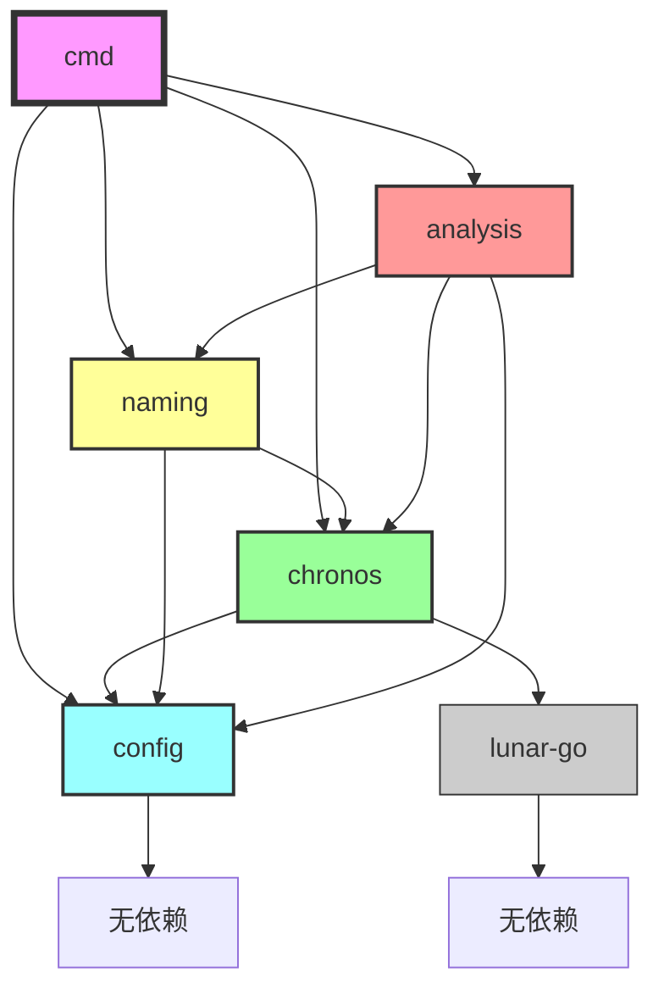

---

## 模块层次关系图

使用 Mermaid 绘制模块层次关系图：

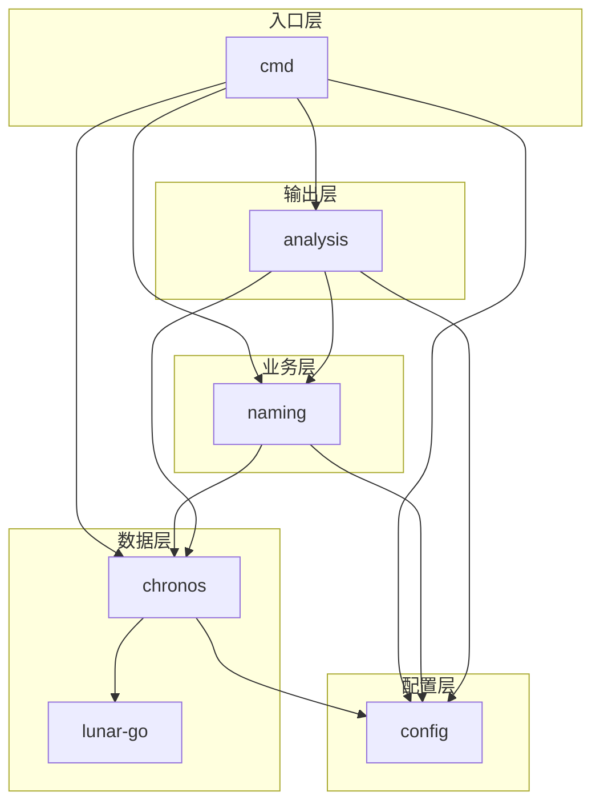

---

## 模块调用关系图

### 单次起名调用关系

使用 Mermaid 绘制单次起名调用关系图：

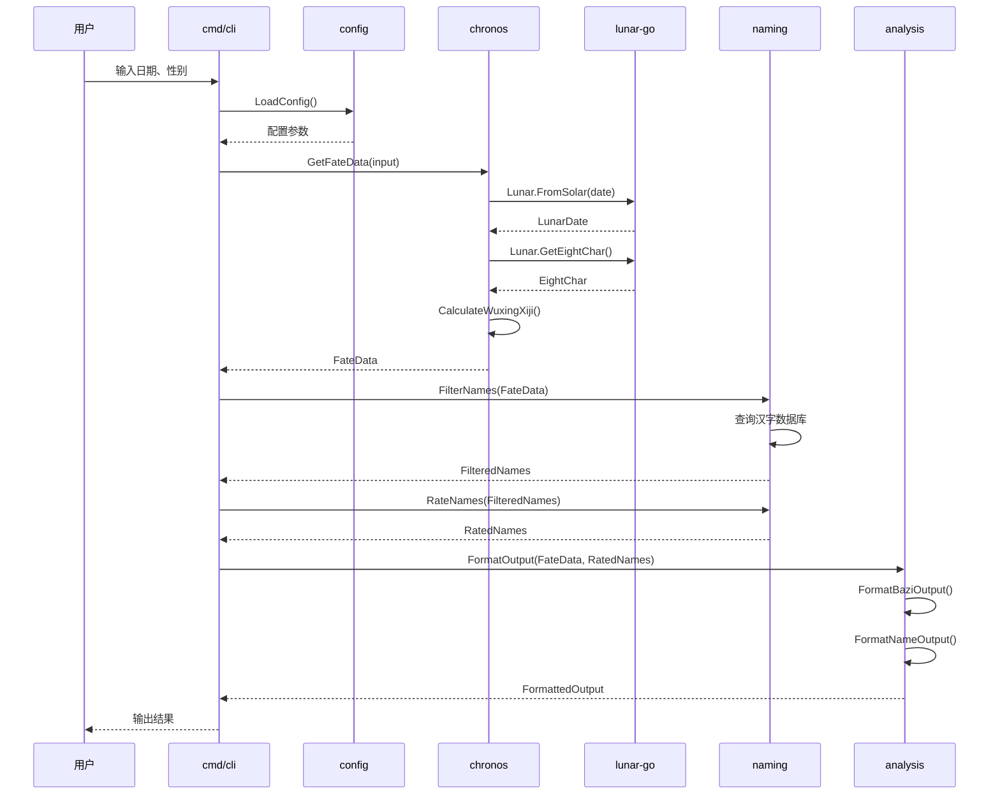

---

### 批量起名调用关系

使用 Mermaid 绘制批量起名调用关系图：

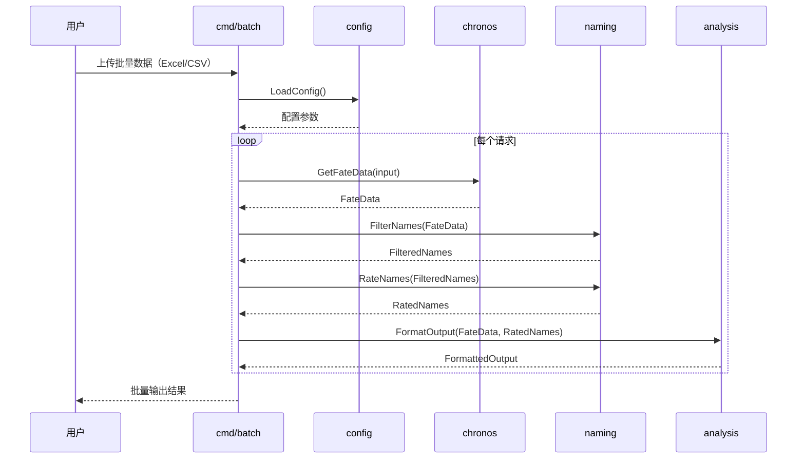

---

### API服务调用关系

使用 Mermaid 绘制 API 服务调用关系图：

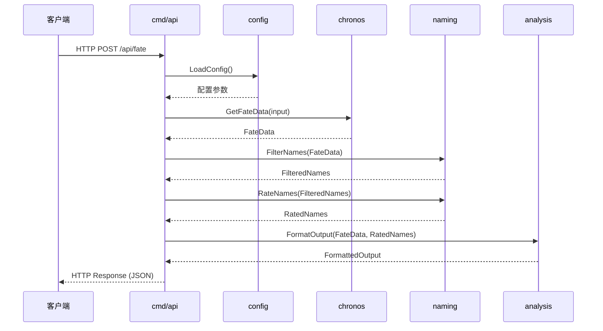

---

## 模块接口关系图

### chronos 接口关系

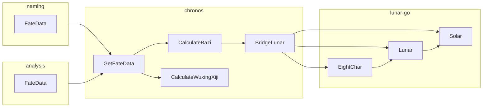

---

### naming 接口关系

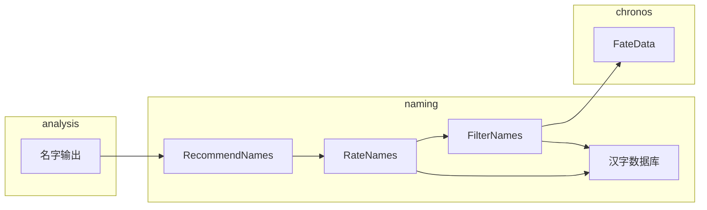

---

### analysis 接口关系

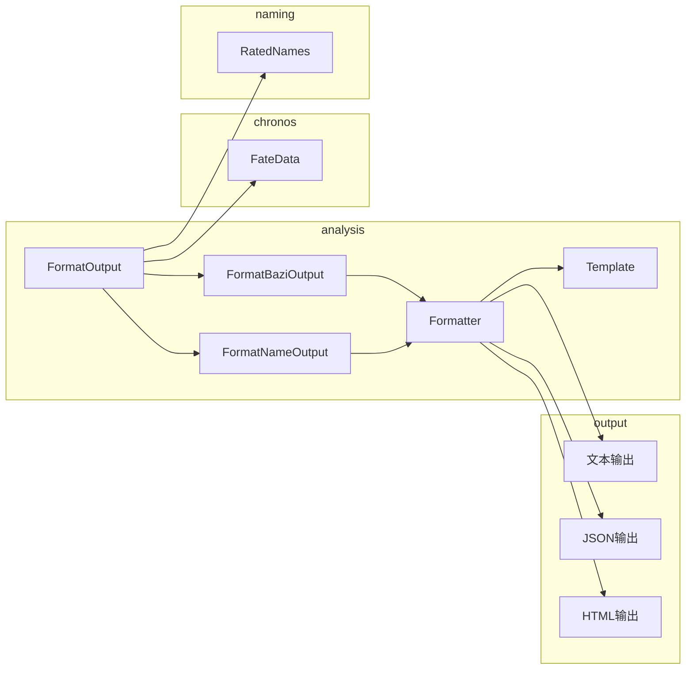

---

## 模块边界图

### 模块边界定义

使用 Mermaid 绘制模块边界图：

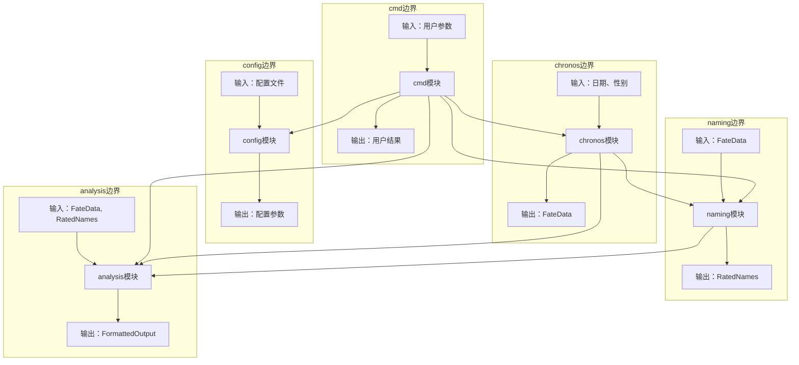

---

## 模块数据流转图

### 数据流转路径

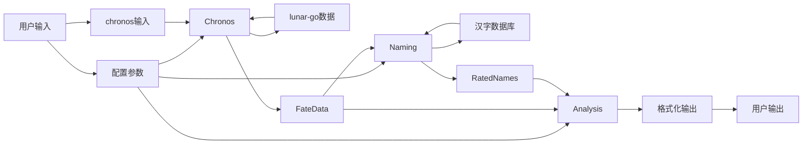

---

## 模块组件图

### chronos 模块组件

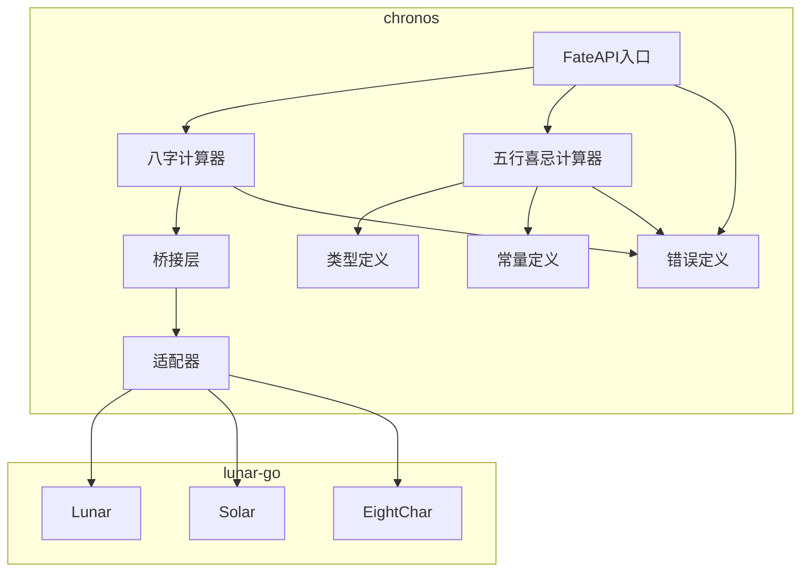

---

### naming 模块组件

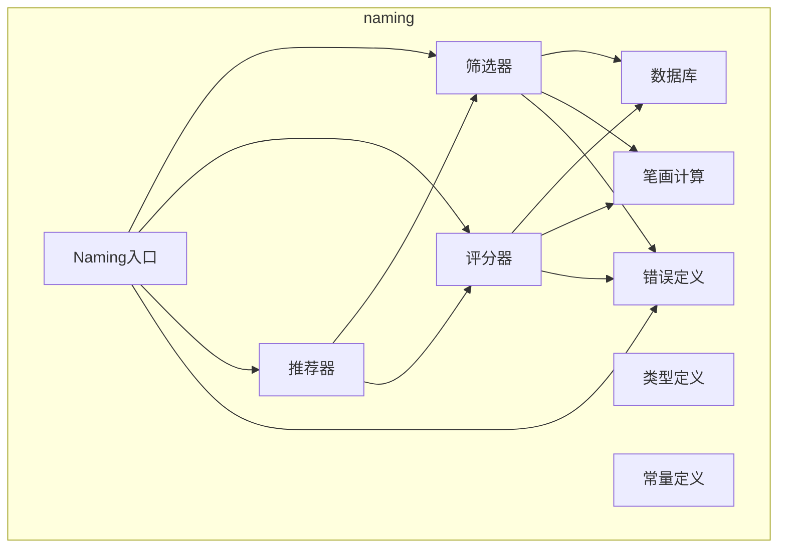

---

### analysis 模块组件

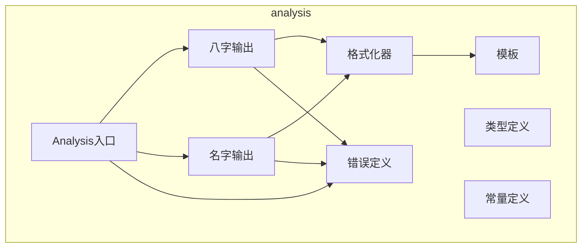

---

## 总结

fate 模块图包括：
- 模块依赖关系图（5个核心模块 + lunar-go依赖）
- 模块层次关系图（入口层、配置层、数据层、业务层、输出层）
- 模块调用关系图（单次起名、批量起名、API服务）
- 模块接口关系图（chronos、naming、analysis接口）
- 模块边界图（明确模块边界）
- 模块数据流转图（数据流转路径）
- 模块组件图（各模块内部组件）

**核心图**：模块依赖关系图、模块调用关系图、模块接口关系图
**辅助图**：模块层次关系图、模块边界图、模块数据流转图、模块组件图