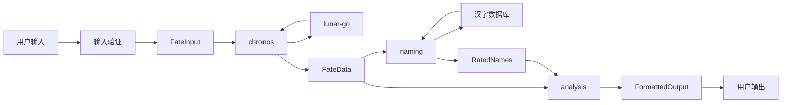
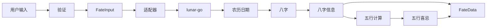
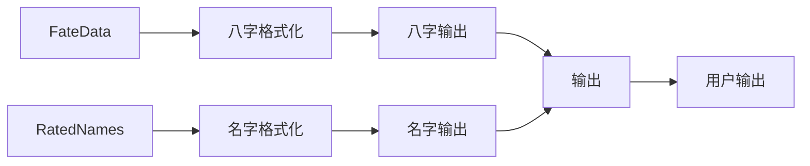

# fate 数据流

## 数据流总览

fate 的数据流从用户输入到用户输出，经过4个主要阶段：

```
用户输入 → FateInput → FateData → RatedNames → FormattedOutput → 用户输出
```

每个阶段都有明确的数据流转和结构转换。

---

## 数据流转路径

### 完整数据流

使用 Mermaid 绘制完整数据流：



---

## 数据结构定义

### 1. FateInput（输入数据）

**定义**：用户输入数据结构

```go
type FateInput struct {
    BirthDate time.Time  // 出生日期（公历）
    Gender    int        // 性别（1男，0女）
    IsLunar   bool       // 是否农历日期
    Surname   string     // 姓氏（可选）
}
```

**数据来源**：用户输入（CLI、API、批量上传）

**数据验证**：
- 日期范围验证（1900-2100年）
- 性别值验证（0或1）
- 农历日期验证（如需要）

---

### 2. FateData（计算数据）

**定义**：chronos 计算输出数据结构

```go
type FateData struct {
    SolarDate  string            // 公历日期 "2020年1月23日 11:31"
    LunarDate  string            // 农历日期 "2019年腊月二十九 午时"
    Gender     int               // 性别 1
    Bazi       *BaziInfo         // 八字信息
    WuxingXiji *WuxingXijiInfo   // 五行喜忌信息
    Dayun      *DayunInfo        // 大运信息（可选）
}
```

**数据来源**：chronos.GetFateData(FateInput)

**数据内容**：
- SolarDate：公历日期字符串
- LunarDate：农历日期字符串
- Gender：性别
- Bazi：八字完整信息
- WuxingXiji：五行喜忌完整信息
- Dayun：大运信息（可选）

---

### 3. BaziInfo（八字信息）

**定义**：八字信息数据结构

```go
type BaziInfo struct {
    Sizhu      [4]string      // 四柱干支 ["甲子", "乙丑", "丙寅", "丁卯"]
    Wuxing     [4]string      // 五行 ["木水", "木土", "火木", "火木"]
    Nayin      [4]string      // 纳音 ["海中金", "海中金", "炉中火", "炉中火"]
    Shishen    [4]string      // 十神 ["比肩", "劫财", "食神", "伤官"]
    Canggan    [4][]string    // 藏干 [["癸"], ["己","辛","癸"], ...]
    Xunkong    [4]string      // 旬空 ["戌亥", "申酉", "午未", "辰巳"]
    Zodiac     string         // 生肖 "鼠"
    Constellation string      // 星座 "水瓶座"
}
```

**数据来源**：chronos.CalculateBazi()

**数据内容**：
- Sizhu：四柱干支（年柱、月柱、日柱、时柱）
- Wuxing：四柱五行
- Nayin：四柱纳音
- Shishen：天干十神
- Canggan：地支藏干
- Xunkong：四柱旬空
- Zodiac：生肖
- Constellation：星座

---

### 4. WuxingXijiInfo（五行喜忌信息）

**定义**：五行喜忌信息数据结构

```go
type WuxingXijiInfo struct {
    DayGan       string        // 日主（天干） "丙"
    DayWuxing    string        // 日主五行 "火"
    XiWuxing     []string      // 喜用五行 ["木", "火"]
    JiWuxing     []string      //忌神五行 ["金", "水"]
    Analysis     string        // 分析说明 "日主身强，喜克泄耗..."
    SuggestWuxing string       // 建议补益五行 "木火"
}
```

**数据来源**：chronos.CalculateWuxingXiji()

**数据内容**：
- DayGan：日主天干
- DayWuxing：日主五行
- XiWuxing：喜用五行列表
- JiWuxing：忌神五行列表
- Analysis：五行喜忌分析说明
- SuggestWuxing：建议补益五行

---

### 5. RatedNames（推荐名字）

**定义**：推荐名字数据结构

```go
type RatedNames struct {
    Names []NameInfo  // 推荐名字列表
}

type NameInfo struct {
    Name       string      // 名字 "张明轩"
    Strokes    int         // 笔画数 15
    Wuxing     string      // 五行属性 "木火"
    Score      float64     // 综合评分 95.5
    Analysis   string      // 分析说明 "五行符合喜用..."
}
```

**数据来源**：naming.RecommendNames(FateData)

**数据内容**：
- Names：推荐名字列表（按评分排序）
- 每个名字包含：名字、笔画、五行、评分、分析

---

### 6. FormattedOutput（格式化输出）

**定义**：格式化输出数据结构

```go
type FormattedOutput struct {
    BaziOutput   string  // 八字解析输出
    NameOutput   string  // 名字解析输出
    Format       string  // 输出格式 "text"
}
```

**数据来源**：analysis.FormatOutput(FateData, RatedNames)

**数据内容**：
- BaziOutput：格式化的八字解析文本
- NameOutput：格式化的名字推荐文本
- Format：输出格式（text、json、html）

---

## 数据流转详细步骤

### 步骤1：用户输入 → FateInput

**数据转换**：

```go
// 用户输入
input := map[string]interface{}{
    "birthDate": "2020-01-23 11:31",
    "gender": 1,
    "surname": "张",
}

// 转换为 FateInput
fateInput := &FateInput{
    BirthDate: parseDate(input["birthDate"]),
    Gender:    input["gender"].(int),
    Surname:   input["surname"].(string),
}
```

**数据验证**：
- 日期范围验证（1900-2100年）
- 性别值验证（0或1）
- 农历日期验证（如需要）

---

### 步骤2：FateInput → FateData（chronos）

**数据转换**：

```go
// chronos 计算
fateData := chronos.GetFateData(fateInput)

// chronos 内部流程：
// 1. lunar-go 桥接：公历转农历
lunar := lunar_adapter.FromSolar(fateInput.BirthDate)

// 2. 八字计算：计算四柱干支
eightChar := lunar.GetEightChar()
baziInfo := chronos.CalculateBazi(eightChar)

// 3. 五行喜忌分析：计算喜用五行、忌神五行
wuxingXiji := chronos.CalculateWuxingXiji(baziInfo)

// 4. 组装 FateData
fateData := &FateData{
    SolarDate:  formatDate(fateInput.BirthDate),
    LunarDate:  formatLunarDate(lunar),
    Gender:     fateInput.Gender,
    Bazi:       baziInfo,
    WuxingXiji: wuxingXiji,
}
```

**数据转换要点**：
- 公历转农历（lunar-go）
- 八字计算（lunar-go + 自定义逻辑）
- 五行喜忌分析（自己实现）
- 数据组装（FateData）

---

### 步骤3：FateData → RatedNames（naming）

**数据转换**：

```go
// naming 筛选和评分
ratedNames := naming.RecommendNames(fateData)

// naming 内部流程：
// 1. 名字筛选：根据五行喜忌筛选
xiWuxing := fateData.WuxingXiji.XiWuxing
filteredNames := naming.FilterNames(xiWuxing)

// 2. 名字评分：综合评分
ratedNames := naming.RateNames(filteredNames, fateData)

// 3. 名字排序：按评分排序
sortedNames := sortNamesByScore(ratedNames)

// 4. 组装 RatedNames
ratedNames := &RatedNames{
    Names: sortedNames,
}
```

**数据转换要点**：
- 根据五行喜忌筛选名字
- 综合评分（五行、笔画、音韵）
- 按评分排序
- 组装 RatedNames

---

### 步骤4：FateData + RatedNames → FormattedOutput（analysis）

**数据转换**：

```go
// analysis 格式化输出
formattedOutput := analysis.FormatOutput(fateData, ratedNames)

// analysis 内部流程：
// 1. 八字解析输出
baziOutput := analysis.FormatBaziOutput(fateData.Bazi)

// 2. 名字解析输出
nameOutput := analysis.FormatNameOutput(ratedNames)

// 3. 组装 FormattedOutput
formattedOutput := &FormattedOutput{
    BaziOutput: baziOutput,
    NameOutput: nameOutput,
    Format:     "text",
}
```

**数据转换要点**：
- 格式化八字解析
- 格式化名字推荐
- 组装输出
- 选择输出格式

---

### 步骤5：FormattedOutput → 用户输出

**数据转换**：

```go
// 用户输出
output := formattedOutput.BaziOutput + formattedOutput.NameOutput

// 输出到用户（CLI、API、批量下载）
fmt.Println(output)  // CLI
// 或 HTTP Response（API）
// 或 下载文件（批量）
```

**数据输出要点**：
- 格式化输出到用户
- 支持多种输出方式（CLI、API、批量）
- 支持多种输出格式（text、json、html）

---

## 数据结构转换图

### 输入到计算的数据转换



---

### 计算到推荐的数据转换


---

### 推荐到输出的数据转换



---

## 数据流转性能优化

### 缓存优化

**缓存策略**：
- 缓存 lunar-go 的常用计算结果（如节气时刻）
- 缓存汉字数据库的查询结果
- 避免重复计算

**缓存示例**：

```go
// 缓存节气时刻
var jieqiCache = make(map[int]time.Time)

func GetJieqi(year int) time.Time {
    if cached, ok := jieqiCache[year]; ok {
        return cached
    }
    jieqi := lunar.GetJieqi(year)
    jieqiCache[year] = jieqi
    return jieqi
}
```

---

### 并发优化

**并发策略**：
- 使用 goroutine 并发处理批量任务
- 使用 channel 通信
- 避免资源竞争

**并发示例**：

```go
// 批量并发处理
func BatchProcess(inputs []*FateInput) []*FormattedOutput {
    var outputs []*FormattedOutput
    var wg sync.WaitGroup
    var mu sync.Mutex
    
    for _, input := range inputs {
        wg.Add(1)
        go func(in *FateInput) {
            defer wg.Done()
            fateData := chronos.GetFateData(in)
            ratedNames := naming.RecommendNames(fateData)
            output := analysis.FormatOutput(fateData, ratedNames)
            mu.Lock()
            outputs = append(outputs, output)
            mu.Unlock()
        }(input)
    }
    
    wg.Wait()
    return outputs
}
```

---

### 数据预加载

**预加载策略**：
- 预加载 lunar-go 的数据表
- 预加载汉字数据库
- 减少运行时加载开销

**预加载示例**：

```go
// 预加载 lunar-go 数据表
func PreloadLunarData() {
    lunar.PreloadTables()
}

// 预加载汉字数据库
func PreloadCharacterDatabase() {
    naming.LoadDatabase()
}
```

---

## 数据流转错误处理

### 输入错误处理

**错误类型**：
- 日期格式错误
- 日期范围错误
- 参数缺失

**错误处理**：

```go
func ValidateInput(input *FateInput) error {
    if input.BirthDate.Year() < 1900 || input.BirthDate.Year() > 2100 {
        return errors.New("日期范围错误：1900-2100年")
    }
    if input.Gender != 0 && input.Gender != 1 {
        return errors.New("性别值错误：0或1")
    }
    return nil
}
```

---

### 计算错误处理

**错误类型**：
- lunar-go 计算错误
- 五行喜忌分析错误

**错误处理**：

```go
func GetFateData(input *FateInput) (*FateData, error) {
    // lunar-go 计算
    lunar, err := lunar_adapter.FromSolar(input.BirthDate)
    if err != nil {
        return nil, errors.New("农历计算错误")
    }
    
    // 八字计算
    bazi, err := CalculateBazi(lunar)
    if err != nil {
        return nil, errors.New("八字计算错误")
    }
    
    // 五行喜忌分析
    wuxing, err := CalculateWuxingXiji(bazi)
    if err != nil {
        // 使用默认值降级处理
        wuxing = DefaultWuxingXiji()
    }
    
    return &FateData{...}, nil
}
```

---

### 推荐错误处理

**错误类型**：
- 筛选结果为空
- 数据库查询错误

**错误处理**：

```go
func RecommendNames(fateData *FateData) (*RatedNames, error) {
    // 筛选名字
    filtered, err := FilterNames(fateData.WuxingXiji.XiWuxing)
    if err != nil {
        return nil, errors.New("名字筛选错误")
    }
    
    // 如果筛选结果为空，扩大筛选范围
    if len(filtered) == 0 {
        filtered, err = FilterNamesWithExpandRange(fateData.WuxingXiji.XiWuxing)
        if len(filtered) == 0 {
            return nil, errors.New("无法筛选到合适的名字")
        }
    }
    
    return RateNames(filtered), nil
}
```

---

## 总结

fate 数据流从用户输入到用户输出，经过4个主要阶段：
1. **输入阶段**：用户输入 → FateInput（验证和转换）
2. **计算阶段**：FateInput → FateData（八字计算、五行喜忌分析）
3. **推荐阶段**：FateData → RatedNames（筛选、评分、排序）
4. **输出阶段**：FateData + RatedNames → FormattedOutput（格式化输出）

每个阶段都有明确的数据结构、数据转换、数据流转、性能优化、错误处理。

**核心数据结构**：FateInput、FateData、BaziInfo、WuxingXijiInfo、RatedNames、FormattedOutput
**数据流转要点**：验证、转换、计算、筛选、评分、格式化、输出