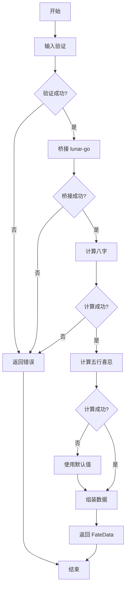

# FateAPI 实现逻辑

## 实现总览

**GetFateData()** 的实现流程：

```
输入验证 → lunar-go桥接 → 八字计算 → 五行喜忌分析 → 数据组装 → 返回
```

---

## 实现流程图

使用 Mermaid 绘制实现流程：



---

## 核心实现代码

### GetFateData() 实现

```go
package chronos

import (
    "errors"
    "time"
    "github.com/6tail/lunar-go/calendar"
)

// 核心接口实现
func GetFateData(input *FateInput) (*FateData, error) {
    // 1. 输入验证
    if err := validateInput(input); err != nil {
        return nil, err
    }
    
    // 2. 桥接 lunar-go
    lunar, err := bridgeLunar(input.BirthDate, input.IsLunar)
    if err != nil {
        return nil, err
    }
    
    // 3. 计算八字
    bazi, err := calculateBazi(lunar)
    if err != nil {
        return nil, err
    }
    
    // 4. 计算五行喜忌
    wuxing, err := calculateWuxingXiji(bazi)
    if err != nil {
        // 降级处理：使用默认值
        wuxing = defaultWuxingXiji(bazi)
    }
    
    // 5. 组装数据
    fateData := assembleData(lunar, bazi, wuxing, input)
    
    // 6. 返回
    return fateData, nil
}
```

---

## 输入验证实现

### validateInput() 实现

```go
// 输入验证
func validateInput(input *FateInput) error {
    // 日期范围验证
    if input.BirthDate.Year() < 1900 || input.BirthDate.Year() > 2100 {
        return &FateError{
            Code:    ErrCodeDateRange,
            Message: "日期范围错误：1900-2100年",
            Module:  "chronos",
        }
    }
    
    // 性别验证
    if input.Gender != 0 && input.Gender != 1 {
        return &FateError{
            Code:    ErrCodeGenderInvalid,
            Message: "性别值错误：0或1",
            Module:  "chronos",
        }
    }
    
    return nil
}
```

---

## lunar-go 桥接实现

### bridgeLunar() 实现

```go
// 桥接 lunar-go
func bridgeLunar(date time.Time, isLunar bool) (*calendar.Lunar, error) {
    if isLunar {
        // 农历转公历
        lunar := calendar.NewLunarFromDate(date)
        return lunar, nil
    } else {
        // 公历转农历
        solar := calendar.NewSolarFromDate(date)
        lunar := solar.GetLunar()
        return lunar, nil
    }
}
```

---

## 八字计算实现

### calculateBazi() 实现

```go
// 计算八字
func calculateBazi(lunar *calendar.Lunar) (*BaziInfo, error) {
    // 获取八字对象
    eightChar := lunar.GetEightChar()
    
    // 组装 BaziInfo
    bazi := &BaziInfo{
        Sizhu:      getSizhu(eightChar),
        Wuxing:     getWuxing(eightChar),
        Nayin:      getNayin(eightChar),
        Shishen:    getShishen(eightChar),
        Canggan:    getCanggan(eightChar),
        Xunkong:    getXunkong(eightChar),
        Zodiac:     lunar.GetShengXiao(),
        Constellation: lunar.GetConstellation(),
    }
    
    return bazi, nil
}

// 获取四柱干支
func getSizhu(eightChar *calendar.EightChar) [4]string {
    return [4]string{
        eightChar.GetYear().GetString(),   // 年柱
        eightChar.GetMonth().GetString(),  // 月柱
        eightChar.GetDay().GetString(),    // 日柱
        eightChar.GetTime().GetString(),   // 时柱
    }
}

// 获取五行
func getWuxing(eightChar *calendar.EightChar) [4]string {
    return [4]string{
        getWuxingString(eightChar.GetYear()),
        getWuxingString(eightChar.GetMonth()),
        getWuxingString(eightChar.GetDay()),
        getWuxingString(eightChar.GetTime()),
    }
}

// 获取纳音
func getNayin(eightChar *calendar.EightChar) [4]string {
    return [4]string{
        eightChar.GetYear().GetNayin().GetString(),
        eightChar.GetMonth().GetNayin().GetString(),
        eightChar.GetDay().GetNayin().GetString(),
        eightChar.GetTime().GetNayin().GetString(),
    }
}
```

---

## 五行喜忌计算实现

### calculateWuxingXiji() 实现

```go
// 计算五行喜忌
func calculateWuxingXiji(bazi *BaziInfo) (*WuxingXijiInfo, error) {
    // 获取日主
    dayGan := bazi.Sizhu[2][0:1]  // 日柱天干（日主）
    
    // 计算日主五行
    dayWuxing := getGanWuxing(dayGan)
    
    // 计算日主强弱
    strength := calculateDayGanStrength(bazi)
    
    // 推导喜用五行和忌神五行
    xiWuxing, jiWuxing := deriveXiJiWuxing(dayWuxing, strength)
    
    // 组装 WuxingXijiInfo
    wuxing := &WuxingXijiInfo{
        DayGan:       dayGan,
        DayWuxing:    dayWuxing,
        XiWuxing:     xiWuxing,
        JiWuxing:     jiWuxing,
        Analysis:     generateAnalysis(dayGan, dayWuxing, strength, xiWuxing, jiWuxing),
        SuggestWuxing: strings.Join(xiWuxing, ""),
    }
    
    return wuxing, nil
}
```

---

## 数据组装实现

### assembleData() 实现

```go
// 组装数据
func assembleData(lunar *calendar.Lunar, bazi *BaziInfo, wuxing *WuxingXijiInfo, input *FateInput) *FateData {
    // 格式化日期
    solarDate := formatSolarDate(input.BirthDate)
    lunarDate := formatLunarDate(lunar)
    
    // 组装 FateData
    fateData := &FateData{
        SolarDate:  solarDate,
        LunarDate:  lunarDate,
        Gender:     input.Gender,
        Bazi:       bazi,
        WuxingXiji: wuxing,
        Dayun:      nil,  // 大运可选，暂不实现
    }
    
    return fateData
}

// 格式化公历日期
func formatSolarDate(date time.Time) string {
    return fmt.Sprintf("%d年%d月%d日 %02d:%02d",
        date.Year(), date.Month(), date.Day(), date.Hour(), date.Minute())
}

// 格式化农历日期
func formatLunarDate(lunar *calendar.Lunar) string {
    return lunar.GetString() + " " + lunar.GetTime().GetString()
}
```

---

## 错误处理实现

### 降级处理

```go
// 默认五行喜忌（降级处理）
func defaultWuxingXiji(bazi *BaziInfo) *WuxingXijiInfo {
    dayGan := bazi.Sizhu[2][0:1]
    dayWuxing := getGanWuxing(dayGan)
    
    // 使用默认值
    xiWuxing := getDefaultXiWuxing(dayWuxing)
    jiWuxing := getDefaultJiWuxing(dayWuxing)
    
    return &WuxingXijiInfo{
        DayGan:       dayGan,
        DayWuxing:    dayWuxing,
        XiWuxing:     xiWuxing,
        JiWuxing:     jiWuxing,
        Analysis:     "无法分析五行喜忌，使用默认值",
        SuggestWuxing: strings.Join(xiWuxing, ""),
    }
}

// 默认喜用五行
func getDefaultXiWuxing(dayWuxing string) []string {
    switch dayWuxing {
    case "木":
        return []string{"水", "木"}
    case "火":
        return []string{"木", "火"}
    case "土":
        return []string{"火", "土"}
    case "金":
        return []string{"土", "金"}
    case "水":
        return []string{"金", "水"}
    default:
        return []string{"木", "火"}
    }
}
```

---

## 性能优化要点

### 1. 缓存 lunar-go 数据

```go
// 缓存节气时刻
var jieqiCache = make(map[int]time.Time)

func GetJieqi(year int) time.Time {
    if cached, ok := jieqiCache[year]; ok {
        return cached
    }
    jieqi := lunar.GetJieqi(year)
    jieqiCache[year] = jieqi
    return jieqi
}
```

---

### 2. 预加载常量数据

```go
// 预加载天干五行对照表
var ganWuxingMap = map[string]string{
    "甲": "木", "乙": "木",
    "丙": "火", "丁": "火",
    "戊": "土", "己": "土",
    "庚": "金", "辛": "金",
    "壬": "水", "癸": "水",
}

func getGanWuxing(gan string) string {
    return ganWuxingMap[gan]
}
```

---

### 3. 避免重复计算

```go
// 计算八字时，一次性获取所有数据
func calculateBazi(lunar *calendar.Lunar) (*BaziInfo, error) {
    // 一次性获取 EightChar
    eightChar := lunar.GetEightChar()
    
    // 一次性计算所有数据
    bazi := &BaziInfo{
        Sizhu:      getSizhu(eightChar),
        Wuxing:     getWuxing(eightChar),
        // ...
    }
    
    return bazi, nil
}
```

---

## 实现要点总结

### 核心要点

| 要点 | 说明 | 重要性 |
|-----|------|-------|
| **输入验证** | 验证日期范围、性别值 | 高 |
| **桥接 lunar-go** | 公历转农历、适配 API | 高 |
| **八字计算** | 获取八字、组装 BaziInfo | 高 |
| **五行喜忌计算** | 自己实现算法 | 高 |
| **数据组装** | 组装 FateData | 高 |
| **错误处理** | 降级处理、错误返回 | 中 |
| **性能优化** | 缓存、预加载、避免重复 | 中 |

---

## 总结

GetFateData() 的实现流程包括输入验证、桥接 lunar-go、八字计算、五行喜忌分析、数据组装、返回。核心实现要点包括输入验证、桥接 lunar-go、八字计算、五行喜忌分析、数据组装、错误处理、性能优化。

**实现流程**：验证 → 桥接 → 计算 → 组装 → 返回
**核心要点**：输入验证、桥接 lunar-go、八字计算、五行喜忌分析、数据组装、错误处理、性能优化
**性能优化**：缓存 lunar-go 数据、预加载常量数据、避免重复计算